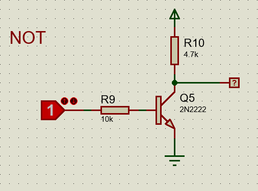
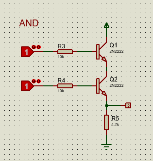
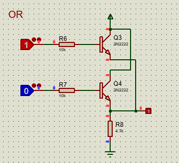
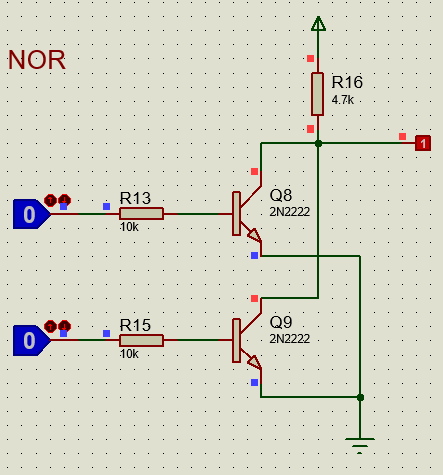

# Compuertas logicas hechas con transistores 2N2222

## Compuertas lógicas básicas

### Compuerta NOT

La compuerta NOT, también conocida como inversor, toma una sola entrada y produce una salida que es el inverso lógico de la entrada. Si la entrada es 1, la salida será 0, y viceversa.
Cuando la entrada A es 0, el transistor está apagado. Entonces la resistencia R10 sube la salida a Vcc, y leemos 1.
Cuando la entrada A es 1, el transistor se enciende y se convierte en un cable hacia tierra. Así, la salida queda en 0.
En pocas palabras: el transistor conecta o desconecta la salida a tierra, invirtiendo la señal.

Su tabla de verdad es la siguiente:
| Entrada A | Salida Q |
|-----------|----------|
|     0     |    1     |
|     1     |    0     |

### Compuerta AND

La compuerta AND toma dos entradas y produce una salida que es 1 solo si ambas entradas son 1. Si alguna de las entradas es 0, la salida será 0.
Cuando ambas entradas A y B son 1, ambos transistores se encienden, conectando la salida a tierra y produciendo una salida de 0.
Si alguna de las entradas es 0, al menos uno de los transistores estará apagado, y la resistencia R10 subirá la salida a Vcc, resultando en una salida de 1.

Su tabla de verdad es la siguiente:
| Entrada A | Entrada B | Salida Q |
|-----------|-----------|----------|
|     0     |     0     |    0     |
|     0     |     1     |    0     |
|     1     |     0     |    0     |
|     1     |     1     |    1     |

### Compuerta OR

La compuerta OR toma dos entradas y produce una salida que es 1 si al menos una de las entradas es 1. La salida será 0 solo si ambas entradas son 0.
Cuando ambas entradas A y B son 0, ambos transistores están apagados, y la resistencia R10 sube la salida a Vcc, resultando en una salida de 1.
Si al menos una de las entradas es 1, el transistor correspondiente se enciende, conectando la salida a tierra y produciendo una salida de 0.

Su tabla de verdad es la siguiente:
| Entrada A | Entrada B | Salida Q |
|-----------|-----------|----------|
|     0     |     0     |    0     |
|     0     |     1     |    1     |
|     1     |     0     |    1     |
|     1     |     1     |    1     |

## Compuerta NAND

La compuerta NAND es la negación de la compuerta AND. Toma dos entradas y produce una salida que es 0 solo si ambas entradas son 1. En cualquier otro caso, la salida será 1.
Cuando ambas entradas A y B son 1, ambos transistores se encienden, conectando la salida a tierra y produciendo una salida de 0.
Si alguna de las entradas es 0, al menos uno de los transistores estará apagado, y la resistencia R10 subirá la salida a Vcc, resultando en una salida de 1.

Su tabla de verdad es la siguiente:
| Entrada A | Entrada B | Salida Q |
|-----------|-----------|----------|
|     0     |     0     |    1     |
|     0     |     1     |    1     |
|     1     |     0     |    1     |
|     1     |     1     |    0     |

## Compuerta NOR

La compuerta NOR es la negación de la compuerta OR. Toma dos entradas y produce una salida que es 1 solo si ambas entradas son 0. En cualquier otro caso, la salida será 0.
Cuando ambas entradas A y B son 0, ambos transistores están apagados, y la resistencia R10 sube la salida a Vcc, resultando en una salida de 1.
Si al menos una de las entradas es 1, el transistor correspondiente se enciende, conectando la salida a tierra y produciendo una salida de 0.

Su tabla de verdad es la siguiente:
| Entrada A | Entrada B | Salida Q |
|-----------|-----------|----------|
|     0     |     0     |    1     |
|     0     |     1     |    0     |
|     1     |     0     |    0     |
|     1     |     1     |    0     |

