# Display de 7 segmentos con transistores NPN

En este proyecto el estudiante aprenderá a diseñar y construir un display de 7 segmentos para mostrar numeros o letras personalizadas.

## ¿Qué es un Display de 7 Segmentos?
Un display de 7 segmentos es un dispositivo que consta de 7 LEDs individuales (segmentos) organizados en forma de "8". Cada segmento se identifica con una letra de la a hasta la g:

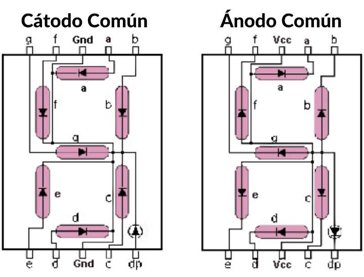

Encendiendo diferentes combinaciones de segmentos podemos formar números, letras y símbolos.
Por ejemplo:
- Para mostrar un **"0"**: encendemos a, b, c, d, e, f (todos excepto g)
- Para mostrar un **"1"**: encendemos solo b, c
- Para mostrar una **"P"**: encendemos a, b, e, f, g

---

## Repaso de Algebra Booleana

El álgebra de Boole es el lenguaje que usamos para describir circuitos digitales. Solo trabaja con dos valores:
- **0** = Apagado / Falso / No hay voltaje
- **1** = Encendido / Verdadero / Hay voltaje

### Operaciones básicas que usaremos en esta practica:

1. **AND (producto lógico)**: Se representa como `A·B` o `AB`
   - Solo es 1 cuando AMBAS entradas son 1
   
2. **OR (suma lógica)**: Se representa como `A + B`
   - Es 1 cuando AL MENOS UNA entrada es 1

3. **NOT (negación)**: Se representa como `A'` o `Ā`
   - Invierte el valor: si A=1, entonces A'=0

### Ejemplo práctico:

Si tenemos la expresión: `Salida = A'B + AB'`

Esto significa: "La salida es 1 cuando (A es 0 Y B es 1) O cuando (A es 1 Y B es 0)"

En otras palabras: **la salida está encendida cuando A y B son diferentes**.

## Mapas de Karnaugh

Los mapas de Karnaugh son una forma visual de simplificar expresiones booleanas. Piensa en ellos como un "crucigrama lógico" que te ayuda a encontrar el patrón más simple.

### ¿Cómo funciona?

1. **Creas una tabla de verdad**: defines cuándo quieres que cada segmento esté encendido
2. **Llenas el mapa de Karnaugh**: colocas 1s donde la salida debe ser 1
3. **Agrupas los 1s**: formas grupos de 1, 2, 4 u 8 elementos adyacentes
4. **Obtienes la expresión simplificada**: cada grupo te da un término de tu ecuación

Aprenderemos a usar mapas de Karnaugh con un ejemplo completo

### Ejemplo Completo: 

Voy a hacer un ejemplo que muestre la palabra "HOLA" en un display de 7 segmentos, utilizaré 3 bits a pesar que la palabra tiene 4 letras, esto es para enseñar como funcionan los valores "dont care" (X) en los mapas de Karnaugh.

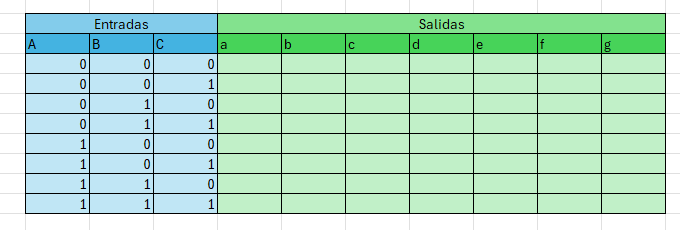

Empezamos llenando la tabla de verdad con los valores de cada entrada, para esto haremos el conteo de 2^n donde n es el numero de bits que tenemos, en este caso 3 bits, por lo tanto 2^3 = 8 combinaciones posibles.

Para rellenar las entradas muy comunmente se llena la mitad de la tabla con 0s y la otra mitad con 1s y en cada columna se alternan los valores cada cierto numero de filas, en este caso la primera columna cambia cada 4 filas, la segunda cada 2 filas y la tercera cada fila.

Luego rellenamos la salida con 1s en las combinaciones que necesitamos para mostrar las letras H, O, L y A, y el resto lo llenamos con 0s. Las combinaciones que no usaremos las marcamos como "X" (dont care).

Para este caso:

- H = 000
- O = 001
- L = 010
- A = 011
- Resto = 100, 101, 110, 111 (dont care)

Para este ejemplo y por claridad de las letras las tomaré como estan en esta imagen:
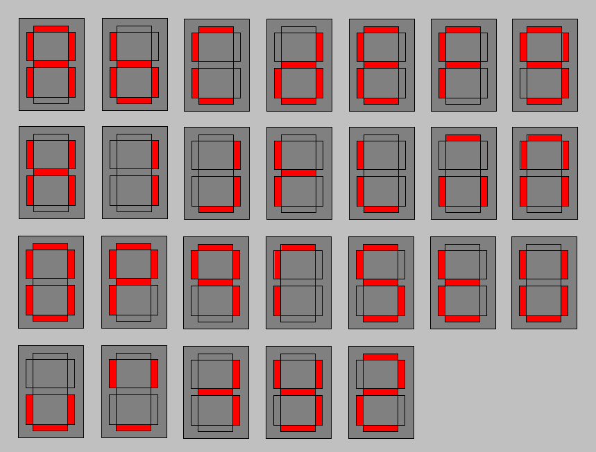

Donde:

| Letra | Segmentos Encendidos |
|-------|---------------------|
|   H   |      b, c, e, f, g  |
|   O   |    a, b, c, d, e, f |
|   L   |        d, e, f      |
|   A   |    a, b, c, e, f, g |

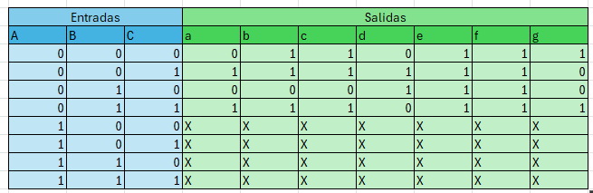

Ahora creamos los mapas de Karnaugh para cada segmento (a-g) usando la tabla de verdad.

#### Mapa de Karnaugh para el segmento "a"

Para hacer un mapa de Karnaugh, tomamos las combinaciones de las entradas (A, B, C) y las organizamos en una cuadrícula. Luego colocamos 1s donde el segmento "a" debe estar encendido según la tabla de verdad.

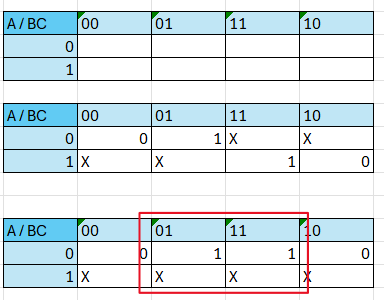

Ingresamos en columna los valores de A y en fila los valores de B y C en el orden Gray (00, 01, 11, 10).

**Agrupamos los 1s:**
- Buscamos agrupar los 1s en grupos de n siendo n una potencia de 2 (1, 2, 4, 8...)
- En este caso con valores dont care podemos agrupar más fácilmente ya que los valores X pueden ser considerados como 1s si nos ayudan a formar grupos más grandes.

Para obtener la expresión simplificada, analizamos cada grupo siguiendo estas reglas:
- Si una variable cambia dentro del grupo, se elimina de la expresión.
- Si una variable permanece constante (0 o 1) en todo el grupo, se incluye en la expresión (si es 0 se incluye negada).

- *Salida_a = C*

#### Mapa de Karnaugh para el segmento "b"

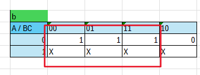

- *Salida_b = B' + C*

#### Mapa de Karnaugh para el segmento "c"

Este como podemos ver se mantiene encendido en las mismas combinaciones que el segmento b.

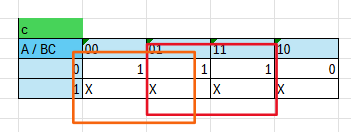

- *Salida_c = B' + C*

#### Mapa de Karnaugh para el segmento "d"

- *Salida_d = B'C + BC'*

#### Mapa de Karnaugh para el segmento "e"

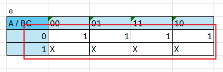

- *Salida_e = 1*

#### Mapa de Karnaugh para el segmento "f"

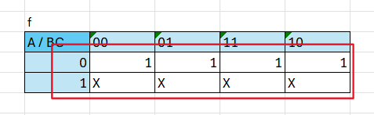

- *Salida_f = 1*

#### Mapa de Karnaugh para el segmento "g"

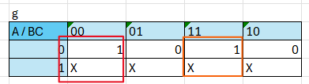

- *Salida_g = B'C' + BC*

### Resumen de las expresiones obtenidas:

- Salida_a = C
- Salida_b = B' + C
- Salida_c = B' + C
- Salida_d = B'C + BC'
- Salida_e = 1
- Salida_f = 1
- Salida_g = B'C' + BC

## Como simplificar las expresiones

En este caso las expresiones ya están simplificadas, pero en otros casos puede que no lo estén. Para simplificar una expresión booleana podemos utilizar la siguiente tabla de reglas:

### Tabla de Leyes del Álgebra de Boole

| Nombre de la Ley | Expresión con OR (+) | Expresión con AND (·) |
|------------------|----------------------|------------------------|
| Leyes de Identidad | A + 0 = A | A · 1 = A |
| Leyes de Nulidad (Nulo) | A + 1 = 1 | A · 0 = 0 |
| Leyes Idempotentes | A + A = A | A · A = A |
| Ley del Complemento | A + A′ = 1 | A · A′ = 0 |
| Ley de Doble Negación | (A′)′ = A | - |
| Leyes Conmutativas | A + B = B + A | A · B = B · A |
| Leyes Asociativas | (A + B) + C = A + (B + C) | (A · B) · C = A · (B · C) |
| Leyes Distributivas | A + (B · C) = (A + B) · (A + C) | A · (B + C) = (A · B) + (A · C) |
| Leyes de Absorción | A + (A · B) = A | A · (A + B) = A |
| Leyes de De Morgan | (A + B)′ = A′ · B′ | (A · B)′ = A′ + B′ |

**Prioridad de operaciones:**
* Primero se resuelven los paréntesis.
* Luego las negaciones (`'`).
* Después los AND (`·`).
* Finalmente los OR (`+`).

[Calculadora para Simplificar mapas de Karnaugh](https://sublime.tools/es/mapa-de-karnaugh)

[Calculadora para Simplificar expresiones booleanas](https://www.boolean-algebra.com/)

## Crear el circuito en Proteus

Ya con las expresiones simplificadas podemos crear el circuito en Proteus utilizando transistores NPN para controlar cada segmento del display de 7 segmentos.

Como hacer operaciones booleanas con transistores NPN se explica en el archivo Compuertas.md

[Ir a Compuertas.md](Compuertas.md)

Y basicamente la idea es usar las expresiones obtenidas para cada segmento y crear el circuito correspondiente con transistores NPN.

Ejemplo solo con el segmento "g" (el mas largo):

Como la expresión es: Salida_g = B'C' + BC

Se necesitan dos compuertas AND y una OR para implementarlo:
- La primera compuerta AND toma las entradas B' y C' (negadas)
- La segunda compuerta AND toma las entradas B y C
- La salida de ambas compuertas AND se conecta a la entrada de una compuerta OR, cuya salida será el segmento "g" del display.

Como podemos ver en la imagen la operacion de la primera parte B'C':

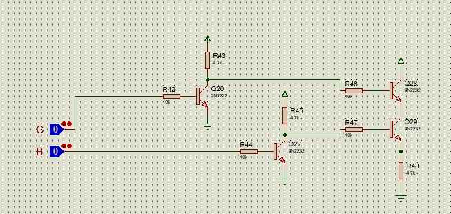

Y la operacion de la segunda parte BC:

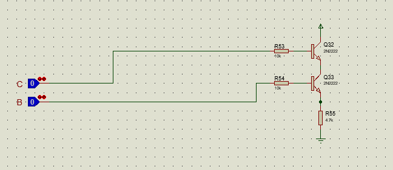

Y se unen ambas salidas en una compuerta OR para obtener la salida final del segmento g

Y siguiendo este mismo procedimiento para cada segmento (a-f) podemos completar el circuito del display de 7 segmentos.

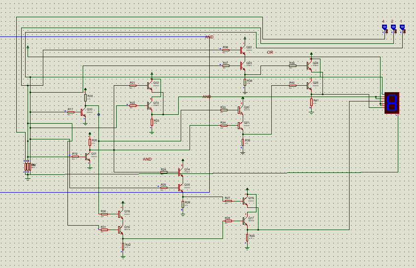

Que va a mostrar la palabra "HOLA" cuando las entradas A, B y C estén en 000, 001, 010 y 011 respectivamente.

